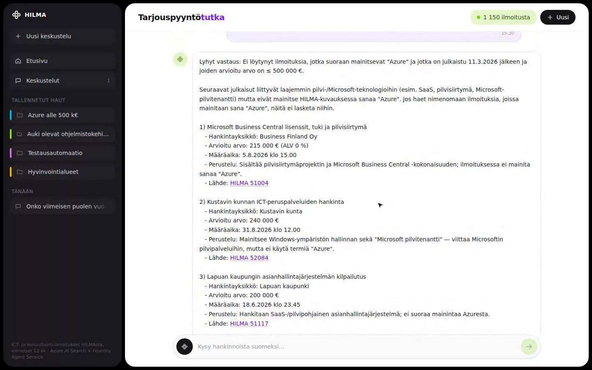
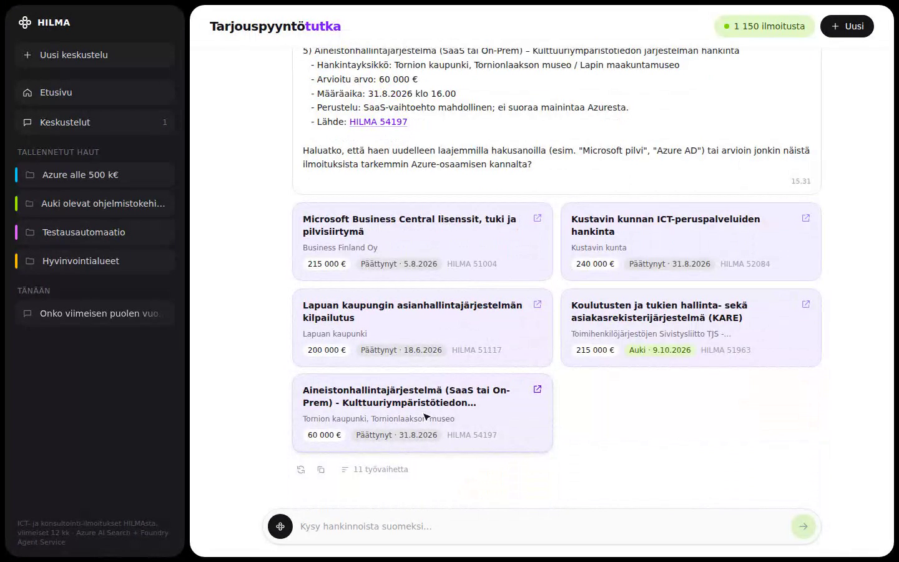
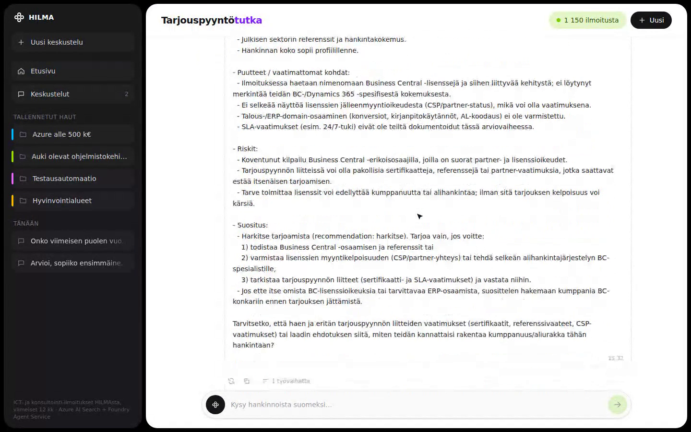
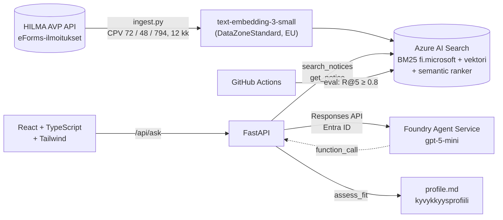

# Tarjouspyyntötutka

[](https://github.com/bashiir-code/tarjouspyyntotutka/actions/workflows/ci.yml)


[](LICENSE)

**Julkisten ICT-hankintojen tutka: agentti lukee HILMA-ilmoitukset ja kertoo lähdeviitteineen, mitkä kilpailutukset sopivat yrityksellesi.**

> *"Onko viimeisen puolen vuoden aikana tullut Azure-osaamiseen liittyviä kilpailutuksia, joiden arvo on alle 500 000 €?"*


*Oikea istunto: kaksi kysymystä, Foundry-agentin vastaukset ja sopivuusarvio. Agentin työskentelyvaiheet on nopeutettu, ja nopeutus näkyy videossa. Video on tehty Remotionilla ([video/](video/)).*

> **In English:** An AI agent that tracks Finnish public procurement notices (HILMA, eForms) and answers questions in Finnish with citations, deadlines and a fit assessment against a company capability profile. Built on Azure AI Search (Finnish BM25 + vectors + semantic ranker) and Foundry Agent Service, measured with a retrieval and groundedness eval that runs in CI. The interesting part is the evaluation: why hybrid search beats pure vector search on Finnish text, and which fixes actually moved the numbers.

## Miksi

Konsulttitalot, kuten Sogeti ja Capgemini, elävät pitkälti julkisen sektorin kilpailutuksista. Relevanttien tarjouspyyntöjen löytäminen HILMAsta on käsityötä, koska ilmoitukset ovat pitkiä, suomenkielisiä ja rakenteeltaan sotkuisia. Tarjouspyyntötutka tekee tämän seulonnan: se ymmärtää, mitä ilmoituksessa oikeasti vaaditaan, noudattaa käyttäjän rajauksia (arvo, aikaväli, auki olevat) ja perustelee jokaisen löydön lähdeviitteellä.

## Kohokohdat

- **Hybridihaku on mitattu, ei oletettu.** 30 kysymyksen evaluoinnissa semantic rankerilla vahvistettu hybridihaku löysi oikean ilmoituksen viiden parhaan joukosta **93 %** ajasta, kun pelkkä vektorihaku ylsi **77–80 %:iin**. Suomen yhdyssanat ja taivutus ovat konkreettinen syy eroon.
- **Agentti ei viittaa muistinvaraisesti.** Jokainen `[HILMA id]` tarkistetaan: ilmoituksen on oltava olemassa, ja saman ajon työkalukutsun on pitänyt hakea se. Tulos on **1.00**.
- **Rajaukset pakotetaan koodissa.** Kehotteen sääntö ei riittänyt, sillä malli jätti arvorajan pois uusintahauissa. Kun rajat pakotettiin koodissa, arvorajan noudattaminen nousi **0.50:stä 1.00:aan**.
- **Foundry Agent Service ja Entra ID.** Agentin määritelmä on koodissa ja versioidaan gitin kautta, ja keskusteluhistoria säilyy palvelimella.
- **Evaluointi ajetaan CI:ssä.** Build kaatuu, jos haun osuvuus heikkenee.

| Vastaus lähdeviitteineen | Lähdekortit | Sopivuusarvio |
|---|---|---|
|  |  |  |

## Arkkitehtuuri



Agentti päättää, mitä työkaluja se kutsuu. Työkalut suoritetaan omassa backendissä, jossa käyttäjän rajaukset ja reranker-kynnys pakotetaan ennen kuin mikään palaa mallille.

| Kerros | Teknologia |
|---|---|
| Data | HILMA AVP Read API (eForms), 11 666 ilmoituksesta 1 150 ICT- ja konsultointi-ilmoitusta |
| Haku | Azure AI Search: `fi.microsoft`-analysaattori, HNSW-vektorit, semantic ranker, rakenteiset suodattimet |
| Mallit | Microsoft Foundry: `gpt-5-mini` (agentti, sopivuusarvio), `text-embedding-3-small` |
| Agentti | Foundry Agent Service (prompt agent + funktiotyökalut), Responses API, Entra ID |
| Backend | Python 3.12, FastAPI, uv |
| Frontend | React 19, TypeScript, Vite, Tailwind CSS 4 |
| Infra ja CI | Bicep, GitHub Actions |
| Demovideo | Playwright-tallenne ja Remotion |

| Osa | Tiedosto |
|---|---|
| Nouto, suodatus, upotukset, indeksointi | [backend/hilma/ingest.py](backend/hilma/ingest.py) |
| Indeksin skeema | [backend/hilma/index.py](backend/hilma/index.py) |
| Hybridihaku ja suodattimet | [backend/hilma/search.py](backend/hilma/search.py) |
| Foundry-agentti (Entra ID, keskustelu palvelimella) | [backend/hilma/foundry_agent.py](backend/hilma/foundry_agent.py) |
| Työkalut, kehote ja rajausten pakotus (myös paikallinen vertailuagentti) | [backend/hilma/agent.py](backend/hilma/agent.py) |
| Kyvykkyysprofiili | [backend/hilma/profile.md](backend/hilma/profile.md) |
| Käyttöliittymä | [frontend/src/App.tsx](frontend/src/App.tsx) |
| Evaluointi | [eval/](eval/) |
| Infra | [infra/main.bicep](infra/main.bicep), [.github/workflows/ci.yml](.github/workflows/ci.yml) |

**Data:** HILMAn hakurajapinnasta `POST /avp/eformnotices/docs/search` haettiin 11 666 eForms-muotoista hankintailmoitusta viimeisen 12 kuukauden ajalta. Niistä 1 150 osui ICT- ja konsultointikoodeihin, jolloin CPV-koodit tarkistettiin sekä pääkohteesta että eristä (lots). Hakurajapinta palauttaa jo kuvauksen, erät, arvon, määräajan ja hankintayksikön, joten erillistä XML-lukurajapintaa ei tarvita.

**CPV-suodatus etuliitteillä:** `cpv_codes`-kenttään tallennetaan täyden koodin lisäksi sen 2-, 3- ja 4-numeroiset etuliitteet. Näin agentti voi rajata esimerkiksi `cpv_codes/any(c: c eq '72')` ilman merkkijonovertailua.

## Foundry Agent Service

Agentti `tarjouspyyntotutka` on Foundry-projektissa prompt agent -tyyppinen agentti. Sen määritelmä on tallessa palvelimella: malli, ohjeet ja kolmen funktiotyökalun skeemat. Myös keskusteluhistoria säilyy palvelimella `conversation_id`:n takana. Backend suorittaa vain työkalut. Agentti käyttää Entra ID -tunnistautumista (`DefaultAzureCredential`): paikallisesti `az login`, Azuressa managed identity. API-avaimia ei tarvita, ja käyttäjällä pitää olla projektiin *Foundry User* -rooli.

- Agentin määritelmä on koodissa. `python -m hilma.foundry_agent deploy` luo siitä uuden version, joten kehotteen muutokset kulkevat gitin kautta eivätkä jää portaalin käsin tehdyiksi muutoksiksi.
- Ohjeet pidetään pysyvinä. Päivämäärä ja koodissa pakotetut rajaukset välitetään jokaisen pyynnön mukana.
- Toteutus käyttää Foundryn REST- ja Responses-rajapintaa jo asennetuilla `openai`- ja `azure-identity`-paketeilla, joten erillistä `azure-ai-projects`-SDK:ta ei tarvita.
- Asetuksella `AGENT_BACKEND=local` käyttöön tulee alkuperäinen Chat Completions -silmukka. Evaluoinnissa toteutuksia voi verrata valitsimella `--backend foundry|local`.

## Käynnistys

```bash
cp .env.example .env         # täytä kaikki kentät
uv sync
az login
cd backend && uv run python -m hilma.index && uv run python -m hilma.ingest
uv run python -m hilma.foundry_agent deploy
cd .. && uv run uvicorn hilma.api:app --app-dir backend --port 8000
cd frontend && npm install && npm run dev   # http://localhost:5173
```

## Evaluointi

### 1. Haun osuvuus: 30 known-item-kysymystä ([eval/retrieval.jsonl](eval/retrieval.jsonl))

Setti koottiin näin: indeksistä poimittiin satunnaisesti 30 ilmoitusta (seed 42). Jokaiseen `gpt-5-mini` kirjoitti kysymyksen, jonka myyjä voisi esittää, mutta **ilman ilmoituksen omia sanamuotoja**: taivutus vaihtuu, yhdyssanat puretaan tai yhdistetään ja tilalle tulee synonyymejä. Esimerkiksi otsikosta *"Työajanseurantajärjestelmän hankinta"* syntyi kysymys *"SaaS-pilvipalvelu työajan kirjausta varten…"*. Mittari kertoo, löytyykö juuri se ilmoitus.

| Hakutapa | R@1 | R@5 | R@10 | MRR@10 |
|---|---|---|---|---|
| BM25 (`fi.microsoft`) | 0.60 | 0.80 | 0.80 | 0.69 |
| Pelkkä vektori (`text-embedding-3-small`) | 0.53–0.57 | 0.77–0.80 | 0.83–0.87 | 0.63–0.66 |
| Hybridi (BM25 + vektori, RRF) | 0.60 | 0.77 | 0.80 | 0.68 |
| **Hybridi + semantic ranker** | **0.70–0.73** | **0.93–0.97** | **0.93–0.97** | **0.81–0.84** |

Luvut ovat useasta ajosta. Vektori- ja reranker-tulokset vaihtelevat hieman ajosta toiseen, BM25 ei.

**Havainnot:**
- **Pelkkä vektorihaku häviää BM25:lle.** Suomenkielinen hankintateksti on täynnä yhdyssanoja ja erisnimiä, kuten *Drupal*, *BW4/HANA*, *Gitlab* ja *PostgreSQL*. `text-embedding-3-small` hukkaa ne, mutta `fi.microsoft`-analysaattori perusmuotoistaa ja pilkkoo yhdyssanat, joten tarkat termit osuvat. Tämä on syy siihen, ettei ratkaisu ole pelkkä vektorihaku.
- **Pelkkä hybridi ei parantanut tulosta.** RRF-yhdistäminen tasoitti BM25:n ja vektorin tulokset lähelle BM25:tä. Hyöty syntyi vasta semantic rankerista, joka luki ehdokkaat ja järjesti ne uudelleen. BM25 ja vektori tuottavat yhdessä hyvän ehdokasjoukon, ja reranker valitsee siitä parhaat.
- Hudit ovat enimmäkseen kysymyksiä, joissa ei ole yhtään tarkkaa termiä, esimerkiksi *"kosketusvuorovaikutuksellinen ohjausjärjestelmä"*, kun ilmoitus on englanniksi (*Immersive space control system*).

### 2. Agentin vastausten pohjautuminen lähteisiin ([eval/agent.jsonl](eval/agent.jsonl))

Jokaisessa ajossa tarkistetaan kolme asiaa:
- **Viitteiden aitous:** jokainen vastauksen `[HILMA id]` on olemassa indeksissä, ja sama ajo on hakenut sen työkalulla. Näin agentti ei voi viitata muistinvaraisesti.
- **Odotettu osuma:** tietty ilmoitus löytyy kysymykseen, jonka vastaus tiedetään.
- **Rajausten noudattaminen:** yksikään viitattu ilmoitus, jonka arvo tiedetään, ei ylitä käyttäjän antamaa arvorajaa.

| Mittari | Vain kehote | + kynnysarvo | + rajaukset koodissa | Foundry Agent Service |
|---|---|---|---|---|
| Viitteet olemassa ja haettu työkalulla | 1.00 | 1.00 | 1.00 | 1.00 |
| Odotettu ilmoitus viitattu (Azure-kysymys) | 1.00 | 1.00 | 1.00 | 1.00 |
| **Arvorajaa noudatettu** | – | 0.50 | **1.00** (lisäksi 3/3 toistoa) | **1.00** |

### 3. Mallideploymentin laatu Foundry-evaluoinnilla ([eval/foundry_evaluations.json](eval/foundry_evaluations.json))

Agentin alla toimiva `gpt-5-mini`-deployment testattiin Foundryn sisäänrakennetuilla arvioijilla. Aineistona oli 45 Foundryn tuottamaa synteettistä kysymystä, arvioijamallina `gpt-5-mini` ja hyväksymisrajana 3 asteikolla 1–5.

| Kriteeri | Arvioija | Läpäisi |
|---|---|---|
| Coherence (johdonmukaisuus) | `builtin.coherence` | 45 / 45 |
| Fluency (kielellinen sujuvuus) | `builtin.fluency` | 45 / 45 |
| Groundedness (pohjautuminen annettuun kontekstiin) | `builtin.groundedness` | 45 / 45 |
| Protected material (suojattu sisältö) | `builtin.protected_material` | 45 / 45 |

Tämä mittaa mallideploymentia yleisellä synteettisellä aineistolla, ei agentin HILMA-vastauksia. Agentin omaa laatua mittaavat osiot 1 ja 2, jotka tarkistavat viitteet ja rajaukset oikeaa dataa vasten. Tulokset on haettu Foundryn Evals-rajapinnasta ja tallennettu repoon.

## Mikä ei toiminut ja mitä korjattiin

1. **Vektorihaku palauttaa aina jotain.** Kysymykseen *"kvanttitietokoneiden ohjelmointi alle 5 000 €"* vektorihaku palautti neljä aiheeseen liittymätöntä ilmoitusta, koska k lähintä naapuria löytyy aina. Reranker-pisteiden tarkastelu näytti selvän eron: epärelevanttien osumien paras pistemäärä oli 1.47 ja oikeiden osumien huonoin 2.13. Agentin hakutyökalu pudottaa nyt tulokset, joiden reranker-pisteet jäävät alle 1.8. Evaluoinnin hakuvertailu ajetaan ilman kynnystä, jotta vertailu hakutapojen välillä pysyy reiluna.
2. **Ensimmäinen testi mittasi väärää asiaa.** Oletin, ettei kvanttiaiheisia ilmoituksia ole, ja testasin, että vastauksessa ei ole viitteitä. Toistoissa agentti kuitenkin viittasi aitoon ilmoitukseen *LUMI-IQ Quantum Computing Platform*, jossa ei ole ilmoitettu arvoa. Se ei ole virhe. Varsinainen virhe oli toisaalla: samassa vastauksessa oli tietoturvatestaus, jonka arvo on 800 000 €. Testi mittaa nyt sitä, mikä oikeasti on väärin, eli rikkooko viitattu ilmoitus käyttäjän antamaa rajaa.
3. **Rajaus kehotteessa ei ole takuu.** Kehotteeseen lisätty sääntö "rajaukset ovat ehdottomia" ei auttanut. Kun malli teki uusintahakuja, se jätti `max_value`-arvon pois. Nyt käyttäjän kysymyksestä poimitaan kerran rakenteiset rajat (`max_value`, `min_value`, `published_after`, `deadline_after`), ja koodi lisää ne jokaiseen hakukutsuun mallin antamien arvojen päälle. Tulos nousi 0.50:stä 1.00:aan.
4. **Kynnysarvolla on hintansa.** Pelkkä sana "Azure" ei läpäise reranker-kynnystä 1.8, koska yhden sanan kyselyt saavat matalat pisteet. Agentti löysi samat ilmoitukset pidemmillä hauilla, kuten "Azure pilvipalvelu", ja kehote ohjaa sitä kokeilemaan useaa muotoilua. Parempi ratkaisu olisi kyselyn pituudesta riippuva kynnys tai suhteellinen kynnys (esimerkiksi 60 % parhaan tuloksen pisteistä). Se vaatii lisää evaluointidataa.
5. **Lähdelista oli liian laaja.** Aluksi käyttöliittymä näytti lähteinä kaikki noin 50 ilmoitusta, jotka agentti oli nähnyt. Nyt `sources` sisältää vain vastauksessa viitatut ilmoitukset, ja `retrieved` pitää kirjaa kaikesta nähdystä groundedness-tarkistusta varten.
6. **Embedding-deployment ei vastannut.** `text-embedding-3-small` GlobalStandard-SKU:lla näkyi tilassa *Succeeded*, mutta palautti swedencentralissa 404 `DeploymentNotFound` vielä 20 minuutin jälkeen. Standard-SKU:ta ei ole tarjolla tällä alueella. DataZoneStandard toimi heti ja pitää käsittelyn EU:ssa, mikä on julkisen sektorin datalle muutenkin oikea valinta.
7. **Päivämäärät näkyivät raakamuodossa.** Agentti kopioi määräajat työkalujen vastauksista sellaisenaan (`2026-08-31T09:00:00Z`). Pyyntö muuntaa ne kehotteessa ei olisi ollut luotettava, joten työkalut palauttavat nyt päivämäärät suoraan suomalaisessa muodossa Helsingin aikaan (`31.8.2026 klo 12.00`).
8. **Käyttöliittymä kaatui mustaksi uusimmassa Chromiumissa.** Automaattivierityksen `useEffect` palautti implisiittisesti `scrollIntoView()`-kutsun paluuarvon. Uudet Chromium-versiot palauttavat siitä Promisen, ja React tulkitsee sen virheelliseksi siivousfunktioksi. Virhe löytyi Playwright-testissä, ei käsin kokeilemalla.

## Rajoitukset ja jatko

- **Evaluointisetti on LLM:n tuottama.** Se on tarkistettava käsin. Osa kysymyksistä vuotaa tarkkoja yksityiskohtia, kuten päivämääriä ja lukuja, mikä helpottaa hakua. Joukossa on myös kaksi ICT:hen kuulumatonta ilmoitusta (metrojunat, jätehuollon verkkosivut), jotka pääsivät mukaan eriin merkityn CPV 48 -koodin vuoksi.
- **Agentin evaluointi on pieni** (7 kysymystä), ja agentin käytös vaihtelee ajosta toiseen. Luotettava arvio vaatii useita ajoja ja mediaanin.
- **Haku ja sopivuusarvio käyttävät yhä API-avaimia.** Agentti tunnistautuu Entra ID:llä, mutta Searchin ja `assess_fit`-mallikutsun avaimet kannattaa vaihtaa managed identityyn, kun sovellus viedään Azureen.
- **Bicep kattaa Searchin ja embedding-deploymentin.** Sovelluksen hostaus (Container Apps ja Static Web Apps) puuttuu vielä.
- **Täysi eForms-XML** (osallistumisehdot, vertailuperusteet) parantaisi `assess_fit`-arviota. Sen lukurajapinnan polkua ei vielä löytynyt.
- **CI** ajaa hakuevaluoinnin oikeaa indeksiä vasten ja kaatuu, jos semantic-haun R@5 laskee alle 0.8. Tämä vaatii GitHub-secretit `FOUNDRY_ENDPOINT`, `FOUNDRY_API_KEY`, `SEARCH_ENDPOINT` ja `SEARCH_API_KEY`.

## Rakenne

```
backend/hilma/   ingest, index, search, agent (työkalut), foundry_agent, api
frontend/        React + TypeScript + Tailwind -käyttöliittymä
eval/            hakuevaluointi, agentin groundedness, Foundry-evaluoinnin tulokset
infra/           Bicep: AI Search + embedding-deployment
video/           Remotion-demovideo ja Playwright-tallennusskripti
docs/            demo-GIF ja kuvakaappaukset
```

## Lisenssi

[MIT](LICENSE)
